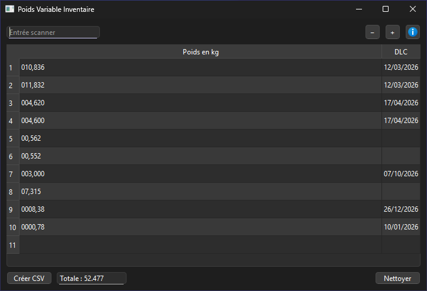

# 🧾 pv-scanner — Inventaire Poids Variable GS1

[](https://www.python.org/)
[](https://pypi.org/project/PyQt6/)
[](LICENSE)
[](https://github.com/gaigher/pv-scanner/issues)

**pv-scanner** est une application de bureau ergonomique développée pour la **saisie rapide de codes-barres GS1 à poids variable**, avec **export CSV**.  
Elle est idéale pour la **gestion d’inventaire** ou le **suivi de stocks de produits alimentaires** via un simple **scanner de codes-barres**.



---

## 🚀 Fonctionnalités principales

- **Saisie rapide par scanner** : champ dédié pour la lecture instantanée.
- **Extraction automatique** :
  - 🧮 **Poids** : extraction et formatage automatique du poids à partir du code scanné.
  - 📅 **DLC (Date Limite de Consommation)** : extraite si présente dans le code-barres.
- **Tableau interactif** :
  - Collage multi-lignes possible (plusieurs scans d’un coup).
  - Ligne vide toujours disponible pour un nouveau scan.
  - Édition manuelle des valeurs.
- **Export CSV** : un clic génère un fichier CSV (UTF-8 avec BOM) compatible Excel.
- **Nettoyage facile** : bouton pour vider le tableau après confirmation.
- **Total automatique** : somme des poids scannés calculée en temps réel.
- **Interface ergonomique** :
  - Zoom ajustable.
  - Messages d’erreur visibles.
  - Flash visuel lors de l’ajout.
  - Feedback sonore intégré.

---

## 🖥️ Utilisation

1. Lancez l’application :
   ```bash
   python pv-scanner.py
   ```
2. Scannez vos codes-barres ou collez-les dans le champ prévu.  
3. Vérifiez les informations affichées dans le tableau.  
4. Cliquez sur **Créer CSV** pour exporter les données.  
5. Utilisez **Nettoyer** pour vider le tableau si nécessaire.

---

## 🧩 Dépendances

- **Python 3.x**
- **PyQt6**

Installation :
```bash
pip install PyQt6
```

---

## ⚙️ Notes techniques

- Les poids sont extraits selon la norme **GS1** :
  - 13 chiffres → extraction des positions **7–11**, format `xx,xxx`.
  - Segment **310xYYYYYY** (caractères 16–26) → format décimal selon `x`.
- La **DLC (AI 15)** est recherchée à partir du **27e caractère**, formatée `JJ/MM/AAAA`.
- Le CSV est encodé en **UTF-8 avec BOM** pour compatibilité Excel.

---

## 🏗️ Création d’un exécutable Windows

Pour distribuer l’application sans installer Python, générez un **exécutable autonome** avec **PyInstaller**.

### Étapes :

1. Installer PyInstaller :
   ```bash
   pip install pyinstaller
   ```

2. Générer l’exécutable :
   ```bash
   pyinstaller --noconfirm --onefile --windowed --icon=favicon.ico --add-data "favicon.ico;." pv-scanner.py
   ```

   - `--noconfirm` : évite les confirmations.
   - `--onefile` : crée un seul exécutable.
   - `--windowed` : masque la console.
   - `--icon=favicon.ico` : ajoute une icône personnalisée.
   - `--add-data` : Indique à PyInstaller d'ajouter des fichiers ou dossiers.

📂 L’exécutable sera disponible dans le dossier **dist/**.

### Remarques :
- L’icône `favicon.ico` doit être dans le même dossier que `pv-scanner.py`.
- Fournir également cette icône lors de la distribution.
- Le premier lancement peut être légèrement plus lent (décompression en mémoire).

---

## 👤 À propos

**Développé par** : [www.gaigher.fr](https://www.gaigher.fr)  
**SIRET** : 798 691 598 00014  

📫 Pour signaler un bug ou proposer une amélioration :  
👉 [Ouvrir une issue](https://github.com/gaigher/pv-scanner/issues)

---

## 📜 Licence

Ce projet est sous licence **MIT**.

---

🧠 *pv-scanner — un outil simple et efficace pour les inventaires de produits à poids variable basés sur la norme GS1.*
